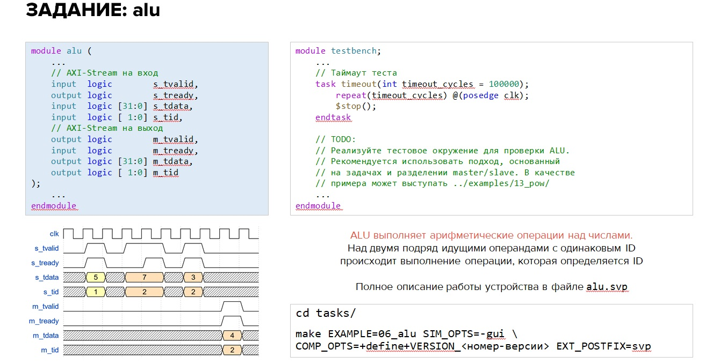

# Домашнее задание к занятию 3

## Задание 1



Проверка модуля АЛУ. Подробное описание работы устройства находится в файле [tasks/06_alu/alu.svp](https://github.com/serge0699/verif_elective_miet/blob/main/lesson_3/tasks/06_alu/alu.svp). Задание находится в файле [tasks/06_alu/testbench.sv](https://github.com/serge0699/verif_elective_miet/blob/main/lesson_3/tasks/06_alu/testbench.sv). Команда запуска: `make EXAMPLE=06_alu COMP_OPTS=+define+VERSION_<номер-версии> SIM_OPTS=-gui EXT_POSTFIX=svp`.

Обратите внимание, что в `<номер-версии>` записывается цифра от 1 до 5. У вас есть 5 различных версий ALU (интерфейс один и тот же). В 1 из 5 багов нет. В 4 из 5 в каждом по 1 уникальному багу. Нужно найти все!

Если `make` запускается с `COMP_OPTS=+define+VERSION_1`, то будет запущен тест 1 версии, если с `COMP_OPTS=+define+VERSION_2`, то 2. И так далее.

## Задание 2

Реализация самого "элегантного" подхода к рандомизации условия:

```verilog
// 4) 'tlast', равный 1, появляется в массиве не чаще, чем раз в 4 значения
```

из [tasks/01_classes/testbench.sv](https://github.com/serge0699/verif_elective_miet/blob/main/lesson_4/tasks/01_classes/testbench.sv). Команда для запуска: `make EXAMPLE=01_classes SIM_OPTS=-gui`.

На скриншоте ниже показано, сколько места занимает решение автора задания.


